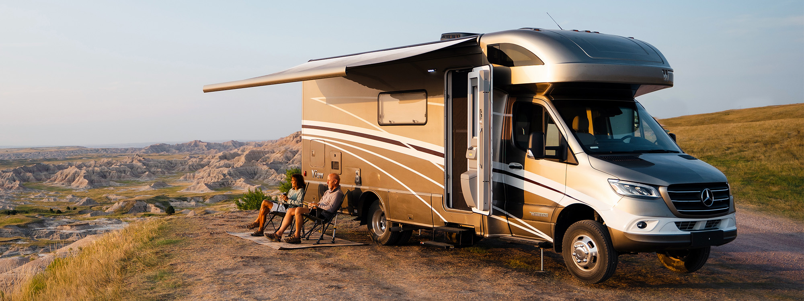

# Our Vehicle

We will be driving the Winnebago View, one of the best RVs the market has to offer. We felt this was the right choice for the trip based on the picture above, where we felt the need to experience the road trippin' experience for ourselves as we saw how much the people in the picture were enjoying it. As mentioned in the schedule, we plan on dumping the brand new vehicle into the Scioto River in Columbus before hijacking a plane back to San Diego.

## Additional Information
[From Winnebago's site](https://www.winnebago.com/models/product/motorhomes/class-c/view)

From Winnebago: "Showcasing boundless freedom combined with upscale comfort, the View® is designed to create memories that last lifetimes. With luxurious details and features throughout, the View’s industry-leading amenities promise an unparalleled Class C experience. And with the dependable diesel-powered Sprinter chassis, you can stay in control, even off-grid."

As you can see, this is the perfect vehicle for our trip. We can't wait to have the time of our lives with this vehicle every step of the way.
