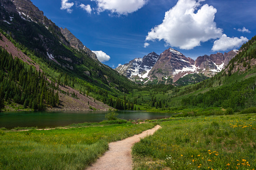
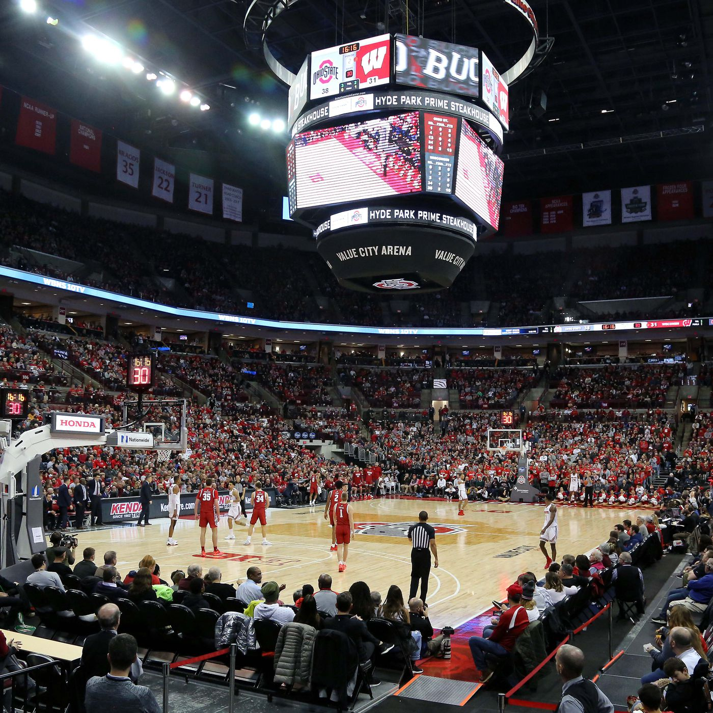

<!--- This section is Cascading Style Sheet (CSS) and applies to HTML -->

# Potential activities
Much of our trip will be based on our moods and the things which we encounter. Some potential activities are listed below

<html>
<body>

<h2>Locate the nearest planned activity on the intinerary</h2>

<input type="button" onclick="alert('The Bellagio Hotel & Casino is 4 hours and 46 minutes away or 307 miles.')" value="Stop 1">

</body>
</html>

## Las Vegas

Our route goes through Las Vegas, Nevada. Depending on our energy level, we may choose to spend time exploring the strip, eating lots of great food, and maybe making a little bit of money on the side.

## Hike in Colorado

As we drive through the rockies, if we have the time and energy we could spend some time exploring the beautiful nature which the mountains have to offer.
<input type="button" onclick="alert('The Colorado hike which is in boulder is a 16 hour and 28 minute drive or 1,074 miles.')" value="Distance to activity 2">

## Nebraska

Nobody knows what goes on in Nebraska. weird stuff..
<input type="button" onclick="alert('The Nebraska emptiness is a 20 hours and 28 minute drive or 1,375 miles.')" value="Distance to activity 3">

## Ohio State Basketball Game

Once we arrive in Columbus, we may attend a basketball game at The Ohio State University. Go buckeyes!
<input type="button" onclick="alert('The Ohio State University is a 33 hour drive or 2,243 miles.')" value="Distance to activity 4">