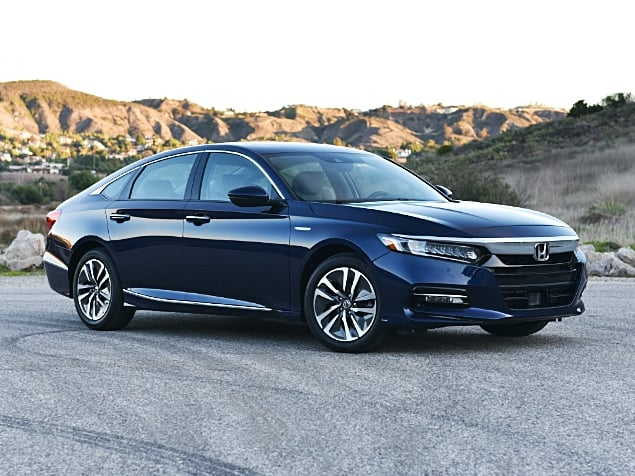

# Find a Car that's Right for You

How many miles are planning on driving?

<input type="radio" value="0-200" name="q1">
<label for="0-200">0-200</label> 
<input type="radio" value="200-500" name="q1">
<label for="200-500">200-500</label> 
<input type="radio" value="500+" name="q1">
<label for="500+">500+</label> 

How much money are you willing to pay per day?

<input type="radio" id="0-20" name="q2">
<label for="0-20">$0-20</label> 
<input type="radio" id="20-50" name="q2">
<label for="20-50">$20-50</label> 
<input type="radio" id="50-80" name="q2">
<label for="50-80">$50-80</label> 
<input type="radio" id="80-100" name="q2">
<label for="80-100">$80-100</label> 
<input type="radio" id="100" name="q2">
<label for="100">$100+</label> 

How nice do you want your car to be?

<input type="radio" id="nicest" name="q3">
<label for="nicest">Nicest available</label> 
<input type="radio" id="luxury" name="q3">
<label for="luxury">Luxury</label> 
<input type="radio" id="nice" name="q3">
<label for="nice">Nice</label> 
<input type="radio" id="cheap" name="q3">
<label for="cheap">Whatever's Cheapest</label> 
<input type="radio" id="no pref" name="q3">
<label for="no pref">No Preference</label> 

<button onclick="displayQ1()">Submit Answers</button>

# 2020 Honda Accord

<b>Price:</b> $35 per day

<b>Gas Mileage:</b> 38 miles per gallon

<button>Reserve</button>

## Review this car 

<input type="text"> /5 <textarea>