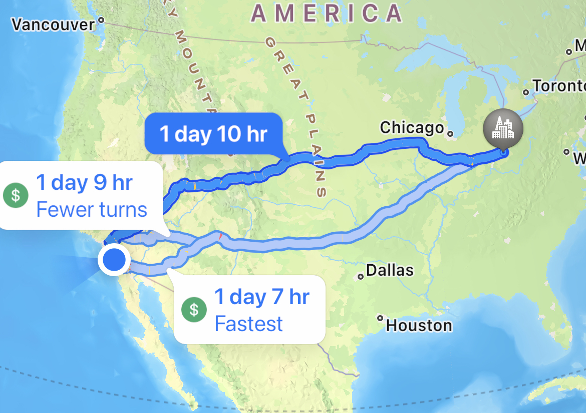

<html>
<head>

</head>
<body>
<h1>Countdown Clock</h1>

  

    
    
Days

  

  

    
    
Hours

  

  

    
    
Minutes

  

  

    
    
Seconds

  

  

  

</body>
</html>

# Basic Information and Route

We will be taking a road trip up to Columbus, Ohio. The trip will take 4 days.

### Route

We plan on going through the midwest, making many stops and exploring new territory, and having a lot of fun! We will go on multiple interstate highways, including I-15, I-70, I-76, I-80, and finally I-74 into Columbus

## Schedule

| Day | Plan |
| --- | --- |
| Monday | We will eat breakfast and lunch at home, leaving mid-afternoon as we begin our drive and spend the night in Vegas |
| Tuesday | We will maybe sleep in after a late and eventful night in Vegas and continue our trip, driving through most of day, and plan to spend the night somewhere in the mountains of Colorado, enjoying the scenery |
| Wednesday | We will make our way out of the rockies and into the midwest as we traverse through Nebraska and Iowa, enjoying the culture. We will stop in Omaha or Des Moines, depending on circumstances such as time and our current mood. |
| Thursday | We will continue the homestretch into Columbus enjoying the culture of beloved Ohio. Possible activities include attending a basketball game at The Ohio State University, gun range, doing other random fun stuff. We will then ditch the RV and sneak on a plane back home. |

# Sign up to come along on the Trip

<form action="create_User()">
    
<label>
        Name:
        <input type="text" name="name" id="name" required>
    </label>

    
<label>
        Password:
        <input type="password" name="password" id="password" required>
    </label>

    
<label>
        Phone:
        <input type="tel" name="phone_num" id="phone_num"
            pattern="[0-9]{3}-[0-9]{3}-[0-9]{4}"
            placeholder="858-111-0938">
    </label>

    
<label>
        Email:
        <input type="email">   
    </label>

    

        <button>Sign up</button>
    

</form>

# Click here to Generate Password

<button onclick="generatePassword()">Generate Password</button>

